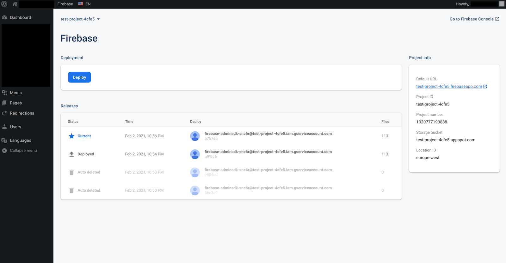
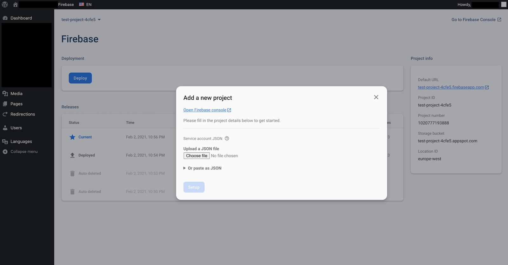

# WP 2 Firebase





Publish WP site to Firebase.

**WARNING: Work in progress, not production ready, use at your own peril.**

Hobby project.

Lots of features and functionality still missing and unfinished, most notably
some links may not be found (i.e. Polylang multi-language pages, sitemaps, files
not under wp-content directory for example favicons uploaded directly under root).

## Prerequisities

1. An existing Firebase project with web platform and hosting activated (no deployments necessary!)
1. WordPress 5.0+
1. PHP 7.2+

## User installation

1. Install plugin
1. Activate plugin
1. Navigate to Firebase under Tools
1. Run through the setup wizard
1. Done!

## Usage

1. Press Deploy to deploy your site to Firebase
1. Enjoy!

### Filters

#### wp2firebase_extra_urls

Type: array of URLs

Default value: an array containing archive link for "post" post type

#### wp2firebase_post_types

Type: array of post type names

Default value: an array containing "page" and "post" as post types

#### wp2firebase_version_config

Type: array containing Firebase version configuration

Default value:

```php
array(
  'config' => array(
    'cleanUrls' => true,
    'headers' => array(),
    'redirects' => array(),
    'rewrites' => array(),
    'trailingSlashBehavior' => 'ADD',
  ),
)
```

## Contribution

### Issues

Feel free to submit issues in the GitHub issues section.

### Pull requests

Feel free to submit pull requests in the GitHub pull requests section.

- Run `npm run build` to build the production files
- Run `composer update --optimize-autoloader` to optimize autoloader and update
  composer packages

### Development

#### Prerequisities

- [Composer](https://getcomposer.org/)
- [Node.js](https://nodejs.org/en/)

#### Stack

- Babel
- Eslint with semistandard
- Prettier
- React 17
- Styled components
- Webpack 5

#### Get started

1. `composer install`
1. `npm install`
1. `npm run dev`

## Disclaimer

WP 2 Firebase WordPress plugin is not affiliated with or endorsed by WordPress,
Firebase, Google, Alphabet or other rightsholders. Any trademarks used belong to
their respective owners.

## License

Copyright (C) 2021 Patrik Juvonen

This program is free software: you can redistribute it and/or modify
it under the terms of the GNU General Public License as published by
the Free Software Foundation, either version 3 of the License.

This program is distributed in the hope that it will be useful,
but WITHOUT ANY WARRANTY; without even the implied warranty of
MERCHANTABILITY or FITNESS FOR A PARTICULAR PURPOSE. See the
GNU General Public License for more details.

You should have received a copy of the GNU General Public License
along with this program. If not, see <https://www.gnu.org/licenses/>.

## Author

Patrik Juvonen

## Changelog

### 1.0.0

- Initial release
